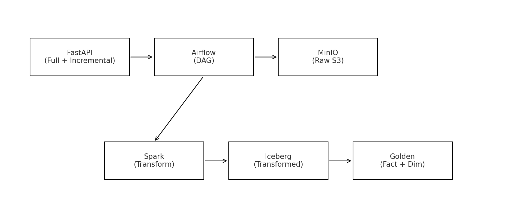

📦 E-Commerce Data Lakehouse (MindGraph Assessment)

This is a small end-to-end data lakehouse pipeline built for the MindGraph technical assessment.
The idea was to simulate an e-commerce system with orders, customers, and products flowing through an API → Airflow → MinIO → Spark → Iceberg → fact/dim tables.

Everything runs locally through Docker Compose.

---

## 1. Architecture Overview

Here’s the basic flow of the project:





---

## 2. FastAPI (Data Source Layer)

The API exposes two routes:

### Full load:

```
GET /extract/full
```

Returns a complete list of order records (mocked).

### Incremental load:

```
GET /extract/incremental?since=<ISO timestamp>
```

Returns only records after a given timestamp.

The data structure reflects a simple e-commerce order (order_id, customer_id, product_id, product_name, order_date, etc.).

---

## 3. Airflow (Orchestration)

DAG handles:

* Day-0 full load
* Regular incremental loads
* Calls the FastAPI endpoints
* Stores raw JSON files into MinIO under:

```
raw/full/<date>/...
raw/increment/<date>/...
```

The DAG is modular and uses parameters for load mode.

---

## 4. Spark + Iceberg (Transform Layer)

A Spark job reads raw JSON files from MinIO using S3-compatible paths.

Transformations done:

* Type casting
* Dropping null/bad records
* Basic enrichment (order_year, order_month)
* Deduplication on order_id
* Partitioning by order_date

Output is written to Iceberg tables:

```
lakehouse_db.orders_transformed
lakehouse_db.customers_transformed
lakehouse_db.products_transformed
```

Iceberg gives schema evolution + efficient reads.

---

## 5. Golden Layer (Dimensional Model)

A simple star schema:

### Fact table:

`fact_sales`

Columns:

* order_id
* customer_id
* product_id
* order_date
* quantity
* amount
* order_year / order_month

### Dimension tables:

```
dim_customers
dim_products
dim_dates
```

A straightforward setup for analytical queries.

---

## 6. How to Run

Make sure Docker Desktop is running.

Then:

```bash
docker compose up --build -d
```

After containers start:

### FastAPI:

```
http://localhost:8000/health
http://localhost:8000/docs
```

### MinIO:

```
http://localhost:9000
user: minioadmin
pass: minioadmin
```

### Airflow (if added):

```
http://localhost:8080
```

Trigger the DAG manually or wait for schedule.

---

## 7. Testing the endpoints (basic)

Full load:

```bash
curl http://localhost:8000/extract/full
```

Incremental:

```bash
curl "http://localhost:8000/extract/incremental?since=2025-11-22T00:00:00Z"
```

---

## 8. Final Validation Checklist

* FastAPI is reachable
* `/extract/full` works
* `/extract/incremental` works
* Airflow DAG runs both modes
* MinIO has raw data buckets
* Spark job successfully reads raw, writes Iceberg
* Iceberg tables created
* Fact/dim tables contain expected rows
* Repo is clean (no `.venv`, no large tmp folders)

---

## 9. Challenges Faced 

* Docker on Windows kept locking some files, especially under `storage/`.
* `.venv` kept breaking docker builds until added to `.dockerignore`.
* Had to fix folder naming mismatch (`incr` vs `increment`).
* Spark → MinIO S3 config took a bit of trial and error.
* Cleaning Git repo without deleting actual local data required some care.

---

## 10. Learnings

* Building everything locally with Docker really helps catch config issues early.
* MinIO behaves almost exactly like S3, which makes testing easier.
* Iceberg is very simple to work with once the config is right.
* Keeping the repo clean matters more than expected, especially with Python + Windows.
* Incremental load paths must be consistent everywhere (API, Airflow, Spark).

---

## 11. Repo Structure 

```
.
├── fastapi_app/
│   ├── app.py
│   ├── Dockerfile
│   └── ...
├── airflow/
│   ├── dags/
│   └── ...
├── spark/
│   └── jobs/transform.py
├── docker-compose.yml
├── README.md
└── .gitignore
```

---

